# renciZone (iRODS at RENCI)

RENCI's deployment of iRODS by and for employees is named `renciZone`.

The authentication is handled via AD/LDAP via PAM, and expects a RENCI username/password.

`renciZone` is only available from within <a href="https://vpn.renci.org">RENCI's VPN</a>.

| Client          | iRODS Metadata Visible? |
| :-------------- | :---------------------: |
| Cloud Browser   |          Yes            |
| iCommands       |          Yes            |
| Cyberduck       |           No            |
| WebDAV          |           No            |

## Cloud Browser

`renciZone` is available via your web browser at <a href="https://irods.renci.org">https://irods.renci.org</a>.

Cloud Browser **is** aware of iRODS metadata.

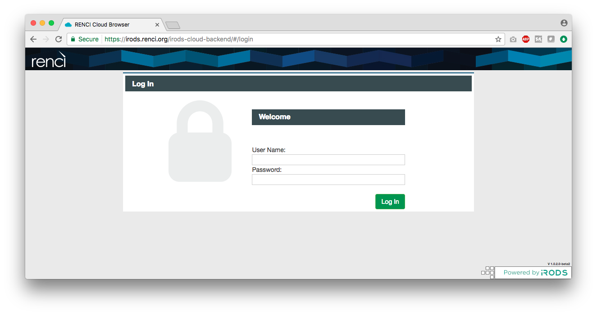

## iCommands

The iCommands can be configured to login to `renciZone` via SSL.

Get the pre-compiled Linux iCommands from https://packages.irods.org (via either APT or YUM).  The iRODS Consortium currently supports Ubuntu 12 and 14, CentOS 6 and 7, and OpenSUSE 13.

<a href="renciZone.crt">Download</a> and point to `renciZone.crt` from your `.irods/irods_environment.json` file:

```
{
    "irods_host": "icat.edc.renci.org",
    "irods_port": 1247,
    "irods_user_name": "USERNAME",
    "irods_zone_name": "renciZone",
    "irods_authentication_scheme": "PAM",
    "irods_client_server_negotiation": "request_server_negotiation",
    "irods_client_server_policy": "CS_NEG_REQUIRE",
    "irods_ssl_ca_certificate_file": "/FULL/PATH/TO/renciZone.crt",
    "irods_encryption_key_size": 32,
    "irods_encryption_salt_size": 8,
    "irods_encryption_num_hash_rounds": 16,
    "irods_encryption_algorithm": "AES-256-CBC"
}

```

Note the `irods_user_name` and `irods_ssl_ca_certificate_file` must be updated with your local information.

Then, run `iinit` and connect.

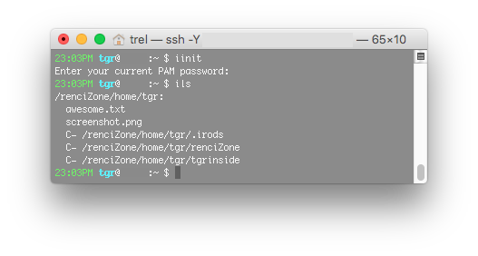


## Cyberduck

Cyberduck is a drag-and-drop client into iRODS.

Cyberduck is **not** aware of iRODS metadata.

Cyberduck 5.4+ knows how to connect to iRODS via PAM.

<a href="https://cyberduck.io/">Download Cyberduck</a>

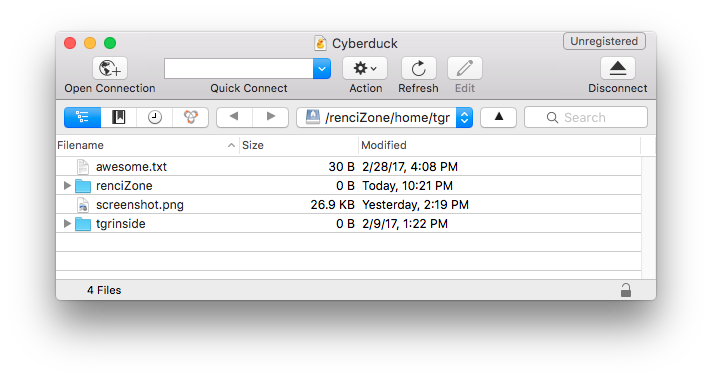

### renciZone.cyberduckprofile

<a href="renciZone.cyberduckprofile">This file</a> will create a bookmark to `renciZone` when opened by Cyberduck for the first time.

```
<?xml version="1.0" encoding="UTF-8"?>
<!DOCTYPE plist PUBLIC "-//Apple//DTD PLIST 1.0//EN" "http://www.apple.com/DTDs/PropertyList-1.0.dtd">
<plist version="1.0">
    <dict>
        <key>Protocol</key>
        <string>irods</string>
        <key>Vendor</key>
        <string>renciZone</string>
        <key>Description</key>
        <string>RENCI iRODS</string>
        <key>Hostname Configurable</key>
        <false/>
        <key>Port Configurable</key>
        <false/>
        <key>Default Hostname</key>
        <string>icat.edc.renci.org</string>
        <key>Region</key>
        <string>renciZone:rootResc</string>
        <key>Default Port</key>
        <string>1247</string>
        <key>Username Placeholder</key>
        <string>username</string>
        <key>Password Placeholder</key>
        <string>password</string>
        <key>Authorization</key>
        <string>PAM</string>
    </dict>
</plist>
```

## WebDAV

File system integration to `renciZone` is made available through a WebDAV interface (<a href="https://github.com/UtrechtUniversity/davrods">using davrods</a>).

WebDAV clients are **not** aware of iRODS metadata.

You can connect to `renciZone` through WebDAV:

### MacOS Finder

"Go->Connect to Server", or "Command-K", or "⌘-K"

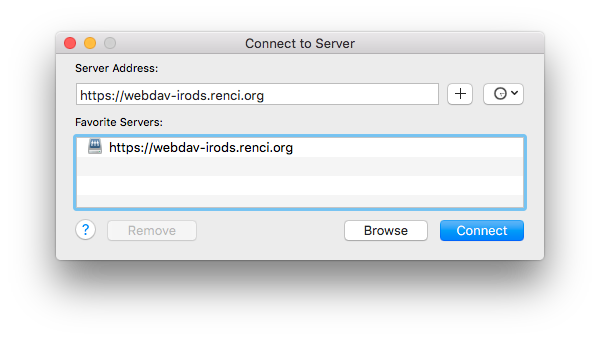

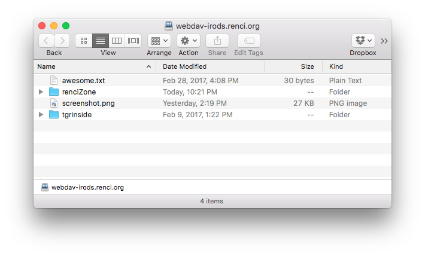

### Windows Explorer

"Computer->Add a network location"

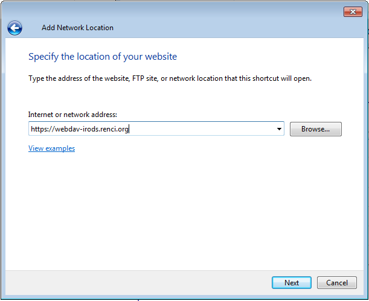

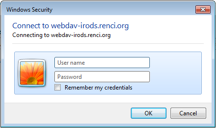

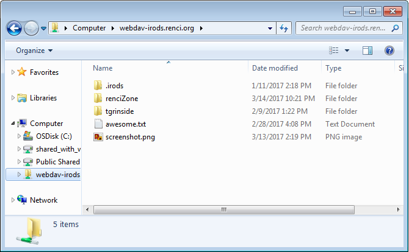


### Kubuntu Linux - Dolphin

Right-click on "Places->Add entry...->Location: `webdavs://webdav-irods.renci.org`"

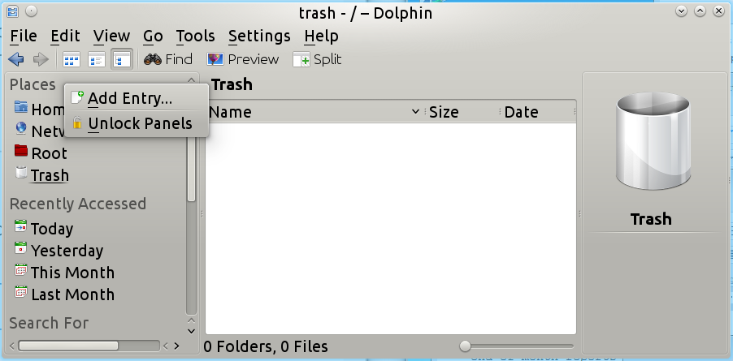

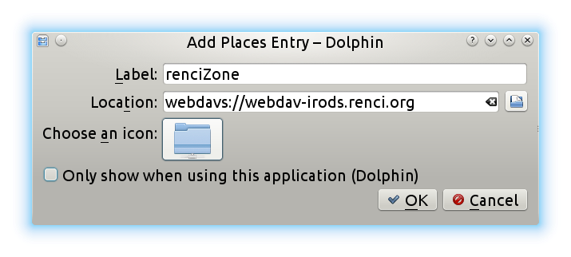

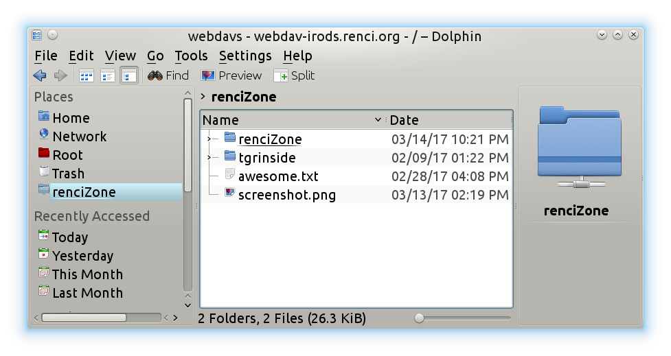


